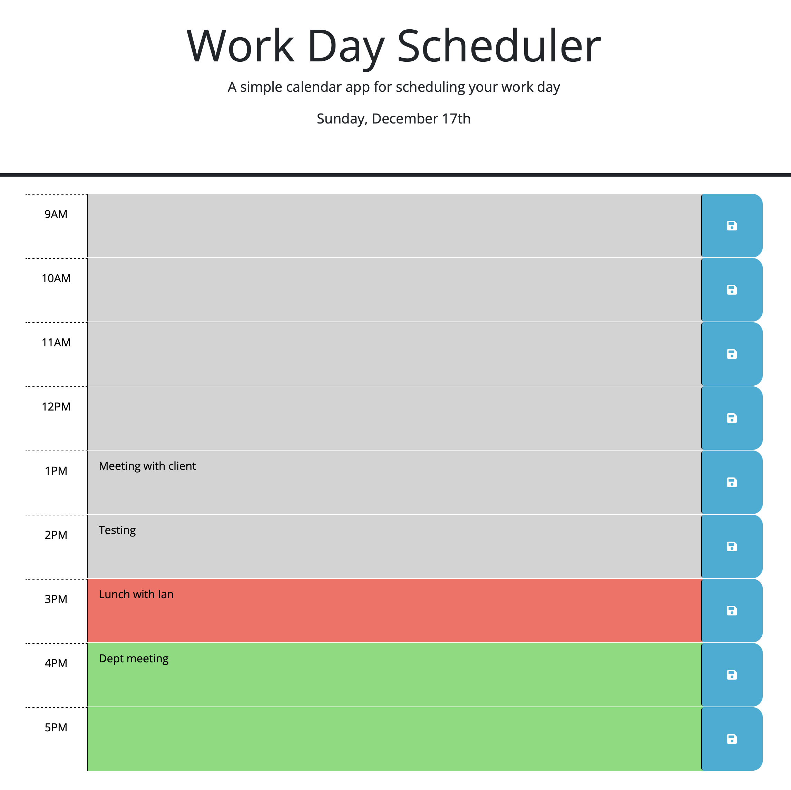

# Work-Day-Scheduler
Challenge #5 in the Coding Bootcamp

This is a calendar scheduling app for a single work day. The user can enter events on an hourly basis beginning on the hour from 9am to 5pm. As the day advances, the color for past events is gray, events for the current hour are highlighted in red, and future events have a background color of green. The current time is displayed.

Events can be saved by clicking on the icon on the right side. Doing so makes them persistent: even if the window or browser is closed, opening the page again in a new browser will cause the saved events to reappear.

The scheduler has been deployed to

<https://clstevenson.github.io/Work-Day-Scheduler/>

Below is a screenshot of the application

